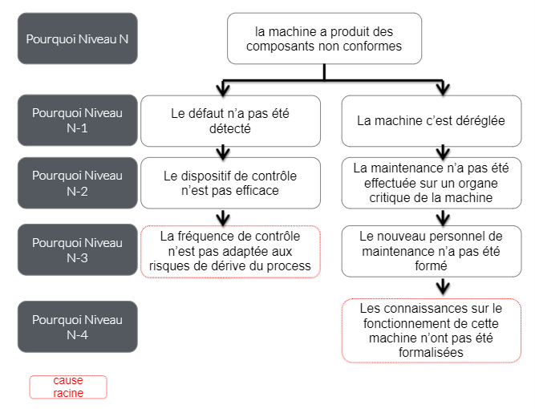

# Définition du lean
Le terme *lean* sert à qualifier une méthode de gestion de la production qui se concentre sur la *gestion sans gaspillage*, ou *gestion allégée*, ou encore gestion *au plus juste*.

L'école de gestion *lean* trouve ses sources au Japon dans le système de production de Toyota ou SPT (*Toyota Production System*).

L'école de philosophie du *lean* est marquée (dans la lignée du taylorisme) par la recherche de la performance (en matière de productivité, de qualité, de délais, et enfin de coûts), censée être plus facile à atteindre par l'amélioration continue et l'élimination des gaspillages, afin d'améliorer la valeur globale pour le client.

Les gaspillages sont au nombre de sept : surproduction, attentes, transport, étapes inutiles, stocks, mouvements inutiles, corrections/retouches.

Formalisée aux Etats-Unis dans les années 1990, adaptable à tous les secteurs économiques le *lean* est actuellement implanté principalement dans l'industrie et surtout l'industrie automobile.

# Les outils du lean
## 1. Les 5 whys
#### Définition
Cet outil permet de **remonter à la cause racine** d'un problème en se posant plusieurs fois la question **Pourquoi ?**.
#### Intérêts
* Ne pas se contenter des **premiers problèmes** soulevés. La plupart du temps, ce **ne sont que des symptômes**.
* En remontant à la cause **racine**, la solution sera plus facile à corriger et **plus efficace** dans le temps.
#### Méthodologie
1. Aller sur le terrain pour identifier le problème
2. Réunir l'équipe
3. Dérouler les 5 whys
4. Rechercher les actions correctives et préventives
5. Déployer la solution aux autres secteurs quand c'est possible

## 2. Le temple du lean
#### Définition
Cet outil symbolise les **principles essentiels pour bâtir une structure solide et efficace**.
